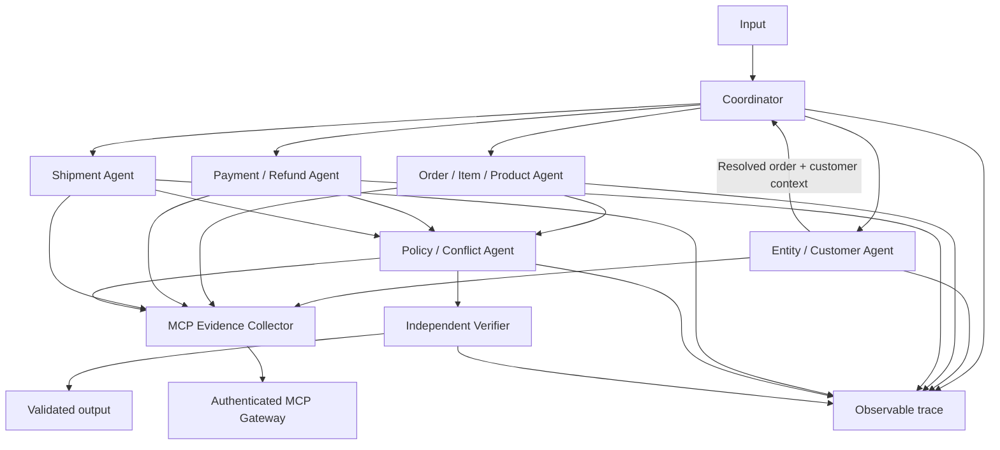

# Day 09 · Multi-Agent MCP + A2A

## 1. Kiến trúc

Hệ thống dùng Python async state machine và semantic-agent gọi model local Qwen2.5 7B qua Ollama/OpenAI-compatible API. Đây là A2A ở mức phối hợp công việc trong cùng process, không phải triển khai giao thức Agent2Agent qua HTTP. Điểm vào: `src/student_agent/workflow.py::solve_case`.



Coordinator resolve entity trước. Khi có đúng một order, ba specialist được giao việc bằng `asyncio.gather`. Policy nhận các kết quả, đề xuất output; verifier kiểm tra độc lập trước khi CLI ghi output và `case_finalized`. Không resolve được entity thì bỏ qua specialist, giữ kết luận cần điều tra và evidence hiện có.

Semantic-agent chỉ được gọi khi có từ hai issue candidate trở lên đã được evidence agent xác nhận. Model chỉ chọn trong candidate list; không được thêm evidence, issue mới, số tiền, trách nhiệm hay action. Single-candidate case giữ quyết định xác định. Model phải là ≤10B; cấu hình nằm trong `.env` và được xác thực trước call.

## 2. Public contracts bất biến

`contracts/schemas/` là nguồn chuẩn duy nhất. Giữ nguyên năm schema đã phát hành: L3A/L3B output V2, trace event V1, submission manifest V2 và MCP evidence V1. Không thêm field nội bộ vào public JSON. `contracts/schema-lock.json` khóa SHA-256 từng schema sau chuẩn hóa CRLF thành LF; test phát hiện thay đổi hoặc thêm/bớt schema. Dùng Draft 2020-12 và FormatChecker, kiểm tra schema khi nạp và kiểm tra mọi artifact/envelope trước khi sử dụng.

`result_hash` được kiểm tra định dạng theo public schema; client không tự đặt thuật toán canonicalization mà contract chưa quy định.

## 3. Quyền agent

| Actor | Trách nhiệm | Tool được phép | Handoff |
| --- | --- | --- | --- |
| coordinator | Điều phối, correlation case | Không | Entity, specialist |
| entity-agent | Ownership, resolve/reject candidates | get_customer_history, get_order | Order và customer context |
| order-agent | Items, sellers, product, tổng dự kiến | get_order_items, get_product_context, get_sellers | Items, total, conflicts |
| payment-agent | Capture/refund lifecycle | get_payment_timeline, get_refund_timeline | Timeline và evidence |
| shipment-agent | Delivery, handoff, seller limits | get_shipment_summary | Shipment summary |
| policy-agent | Policy, conflict, actions | get_policy | Output đề xuất |
| verifier | Schema, receipts, invariants | Không | Validated output hoặc exception |

`evidence.py::PERMISSIONS` kiểm tra quyền trước call. Gateway phải discovery tool (có phân trang), rồi validate arguments bằng input schema do server công bố. Không gọi tool chưa được quảng bá. `get_sellers` được cấp quyền nhưng chưa cần gọi vì items đã chứa seller ID. Không gọi cả payments gốc và timeline trùng lặp.

## 4. A2A và entity resolution

Broker được tạo riêng cho mỗi `solve_case`, giữ `case_id` bất biến. Message observable dùng đúng trace schema: case_id, event_id, actor, target, event_type, decision_code, evidence_refs, attributes nếu cần. Payload nghiệp vụ đi qua return value Python, không xuất prompt, chain-of-thought hoặc dữ liệu thô vào trace. Đồ thị hữu hạn, không có vòng lặp handoff vô hạn.

Candidate được đối chiếu customer history; claimed exact ID chỉ được ưu tiên nếu thuộc history. Một match phải được `get_order` chứng thực. Nhiều match chưa định danh được thì ambiguous. Candidate ngoài history được reject; không quét specialist cho candidate bị reject. Không có hint thì chỉ resolve direct order khi đúng một candidate và tool xác nhận. Confidence: 0.98 với history+order, 0.70 với direct order, 0.20 với ambiguous. Các ngưỡng theo quy tắc, chưa calibration theo nhãn ẩn.

## 5. Evidence và conflict

Broker có cache/receipt riêng mỗi case. Cache key gồm tool+arguments, không chia sẻ qua case/run hoặc đọc evidence giả từ disk. Lock theo cache key gộp call trùng đồng thời. Trả deep-copy và phát `tool_result_consumed` khi agent dùng evidence.

Collector kiểm tra envelope, domain, scope case/order/customer/policy tại field xuất hiện trong payload, kể cả nested rows; chặn ref đổi nội dung. Verifier chỉ nhận ref trong receipts case hiện tại. Server kiểm tra ownership team/run và audit; client không tự chứng thực được ownership trên server.

Catalog mô tả `get_order` là authoritative nên trạng thái hiện tại được ưu tiên hơn history và ghi conflict. Item cùng ID khác nội dung hoặc shipment event mâu thuẫn timestamp được giữ UNRESOLVED, selected_source=null. Không tự đặt source precedence khi policy không có. Conflict chưa giải quyết làm giảm confidence, chặn khuyến nghị trả tiền, chuyển needs_investigation. Claim chỉ ưu tiên issue đã chứng minh độc lập, không tạo sự thật.

Tính tiền bằng Decimal hai chữ số. Chỉ cộng capture confirmed/completed; không nhân số installments thành charges. Refund pending/failed không là tiền đã trả. Thiếu refund evidence thì refunded/refundable=null, không tự coi bằng 0. Policy phải đúng version/currency, recommendation không vượt captured trừ refunded. Actions chỉ là khuyến nghị trong artifact, không thực hiện chuyển tiền.

## 6. Failure và efficiency

| Failure | Retry budget | Fallback / trace |
| --- | ---: | --- |
| Timeout/transport | 2 attempts tổng, backoff 0.25s | Missing; MCP_RETRY, MCP_TIMEOUT |
| Semantic tool error | 0 retry | Missing; MCP_TOOL_ERROR |
| Tool không discovery | 0 call | TOOL_UNAVAILABLE |
| Hết budget | 16 attempts/case | CALL_BUDGET_EXHAUSTED |
| Schema/domain/scope sai | 0 retry | Exception, không verification thành công |
| Entity ambiguous | Không quét rộng | AMBIGUOUS |
| Source conflict | Không gọi lặp cùng tool | Giữ conflict, cần điều tra |

Timeout broker 25 giây/call. Discovery cache trong gateway session. Luồng thông thường 7–8 attempts/case tùy product/refund scope. CLI chạy case tuần tự, ba specialist tối đa. SDK transport hỗ trợ concurrent requests. Transport sync dùng httpx2.Client đồng bộ với kết nối HTTP tái sử dụng, request tuần tự, socket timeout 20 giây, cho gateway trả finite JSON/SSE khi SDK bị lỗi transport trên máy. Vẫn gửi MCP initialize, initialized notification, tools/list, tools/call, giữ session/protocol headers và dùng SDK types validate result. Chặn redirect để không chuyển credential sang host khác. Không hỗ trợ subscription hoặc server-initiated sampling. Không tự retry cả run vì mọi call đều có thể bị audit.

## 7. Verification và artifact

Verifier kiểm tra schema; case ID; resolved=affected orders; không chứa rejected candidate; receipts; claim linkage; tổng refund lines; refundable=captured-refunded; recommendation không vượt số dư; status phù hợp refund; selected source thuộc sources; seller chịu trách nhiệm thuộc resolved order.

Packager yêu cầu đủ 100 outputs đúng inventory, trace lifecycle đủ và receive/finalize đúng thứ tự, evidence được consume trong trace, không reuse ref qua case, không có team key. ZIP chỉ chứa:

```text
manifest.json
trace.jsonl
outputs/<case_id>.json
```

Giới hạn 1 MB/file, 12 MB giải nén. Source, input, .env và diagnostics không được đóng ZIP. Schema pass không đảm bảo semantic score cao khi evidence nguồn mâu thuẫn.

## 8. Tái lập

Python 3.11+, không model hoặc random seed cho quyết định. Event ID/timestamp là metadata runtime. `requirements-lock.txt` ghi dependency đã kiểm thử; pyproject giữ range tương thích.

```powershell
python -m venv .venv
.venv/Scripts/python.exe -m pip install -r requirements-lock.txt
.venv/Scripts/python.exe -m pip install -e . --no-deps
.venv/Scripts/python.exe -m pytest -q
.venv/Scripts/python.exe -m ruff check .
.venv/Scripts/python.exe -m student_agent.cli --input-root l3b-inputs-v1 validate-inputs
.venv/Scripts/python.exe -m student_agent.cli mcp-tools
.venv/Scripts/python.exe -m student_agent.cli --input-root l3b-inputs-v1 run
.venv/Scripts/python.exe -m student_agent.cli --input-root l3b-inputs-v1 validate
.venv/Scripts/python.exe -m student_agent.cli --input-root l3b-inputs-v1 package --output dist/submission.zip
```

Key chỉ ở .env. Thêm MCP_TRANSPORT=sync nếu cần fallback HTTP, mặc định sdk. Mở run L3B trước thu evidence, không reset run giữa lúc thu evidence và nộp ZIP.

Nếu ngắt vì lỗi mạng, chạy lại run --resume trong cùng competition run. Lệnh giữ case đã finalized và verified; trace của attempt bị ngắt lưu riêng trong traces/interrupted-attempts.jsonl. Không resume nếu đã đổi team/key hoặc reset run.

Sau validate/package, dùng day09 --input-root l3b-inputs-v1 submit để nộp qua API V2 chính thức; receipt được ghi cạnh ZIP. Dùng day09 status RECEIPT để xem kết quả. Upload không tự retry để tránh nộp trùng.
